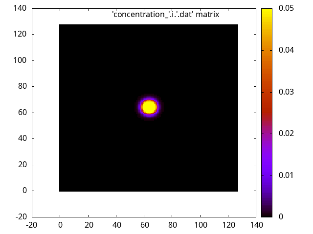
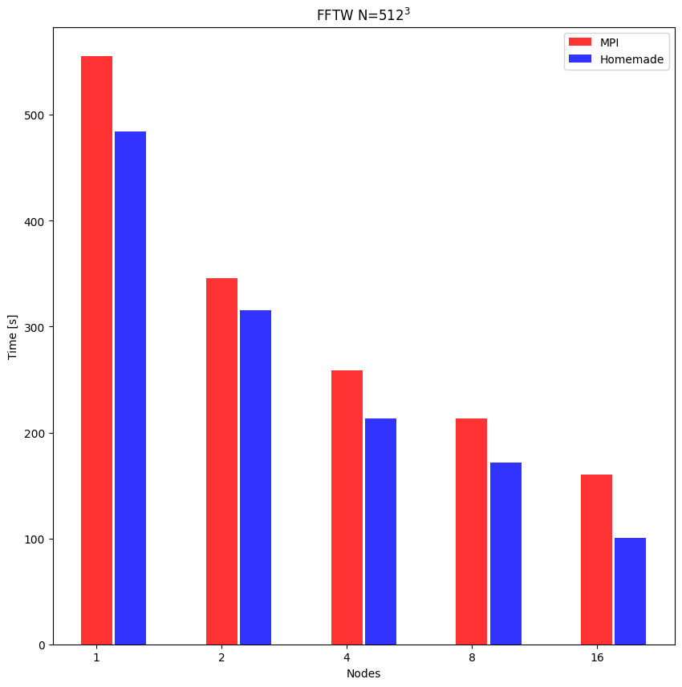

# FTT diffusion

Parallel distributed diffusion solver with `fftw`.

## Building 

The provided `Makefile` will build:

- An *handmade* version that exploit the advanced `fftw` interface.
- A parallelized version that use the `lfftw3_mpi` library. 

## Results

The final result of the simulation can be visualized with the following git:

### Timing

