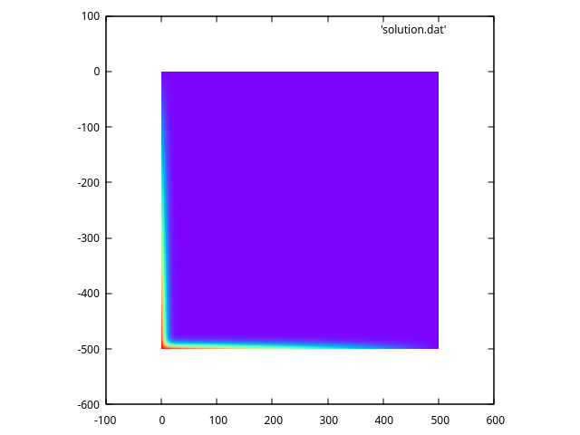
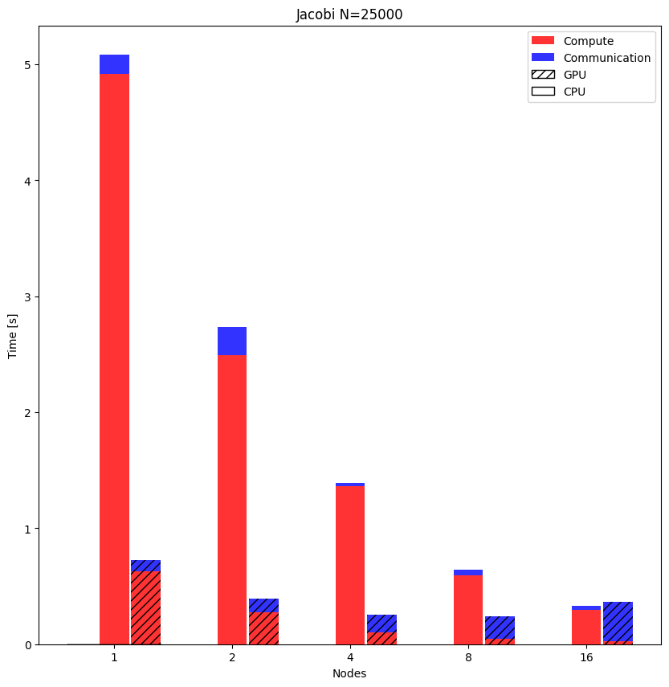

# Jacobi solver

Parallel distributed iterative jacobi solver.

## Building 

The provided `Makefile` will build:

- A simple jacobi solver distributed with MPI: `jacobi_cpu.x`.
- A version that exploit the `hdf5` format (and libraries) to save the intermediate step in order to visualize them. This version exploit the computation on cpu: `jacobi_hdf5.x`.
- A version that exploit the gpu acceleration provided by openACC.

In order to compile the executables on `m100`, run `compile.sh`.
The first two exectuables use `spectrum_mpi`, the last one use `openMPI` that is wrapped around `nvc` provided by the `hpc-sdk` kit.

## Results

The final result of the simulation can be visualized with the following plot:

The intermediate step can be rendered using `Visit`:

https://github.com/NiccoloTosato/ParallelProgramming/assets/22773880/352dc296-cf22-4367-a747-cbaceb137ed9

### Timing

