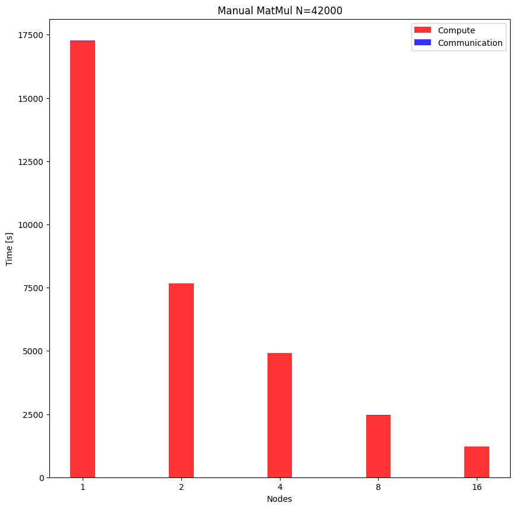
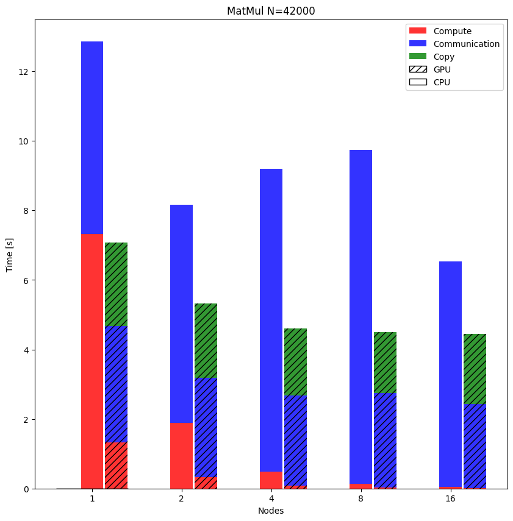
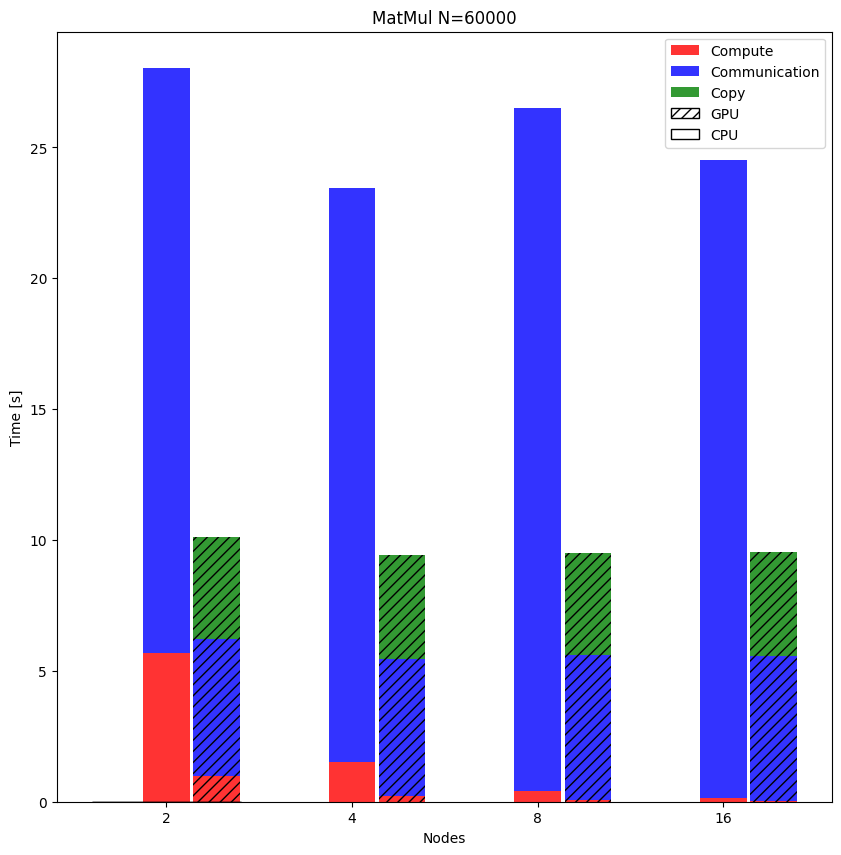

# Parallel MatMul

Parallel distributed matrix multiplication.

## Building 

The provided `Makefile` will build:

- A simple Matrix multiplication distributed with MPI: `matrix.x`.
- A *test* executable that collect the results a compare them with ones coming from `DGEMM`: `matrix_test.x`.
- A version that use the `DGEMM` implementation to perform the distribuited computation: `matrix_dgemm.x`.
- A version that exploit the `cublas` routine to perform the computation.

In order to build on `m100`, execute `compile.sh`.

## Results

### *handmade* version 

### `openBLAS` vs `cublas`

